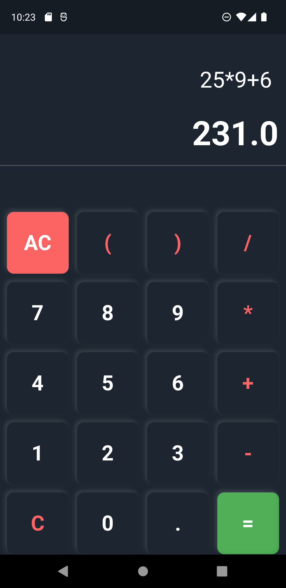

# SIMPLE CALCULATOR : IN FLUTTER-DART
 <h2>TABLE OF CONTENTS<h2>
 <ul>
 <li><a href="#presentation">PRESENTATION OF THE APP</a></li>
 <li><a href="#run">HOW TO RUN THE APP</a></li>
 </ul>
 
 <h2 id="presentation">PRESENTATION OF THE APP</h2>
 This is a simple calculator build in dart with the framework flutter.

 <h2 id="run">HOW TO RUN THE APP</h2>
 First you must have all you need to execute an mobile app with your computer.
 Second you need to install <a href="https://dart.dev/get-dart">dart</a> and <a href="https://docs.flutter.dev/get-started/install">flutter</a> sdks.
 Third you run the  `main.dart` file in  `/lib` directory
